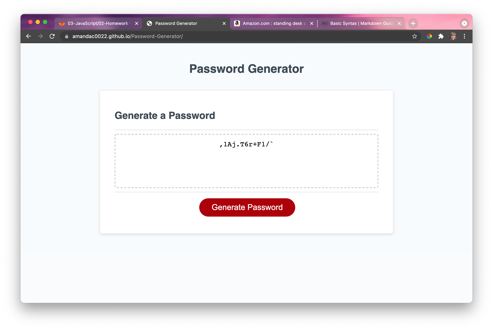
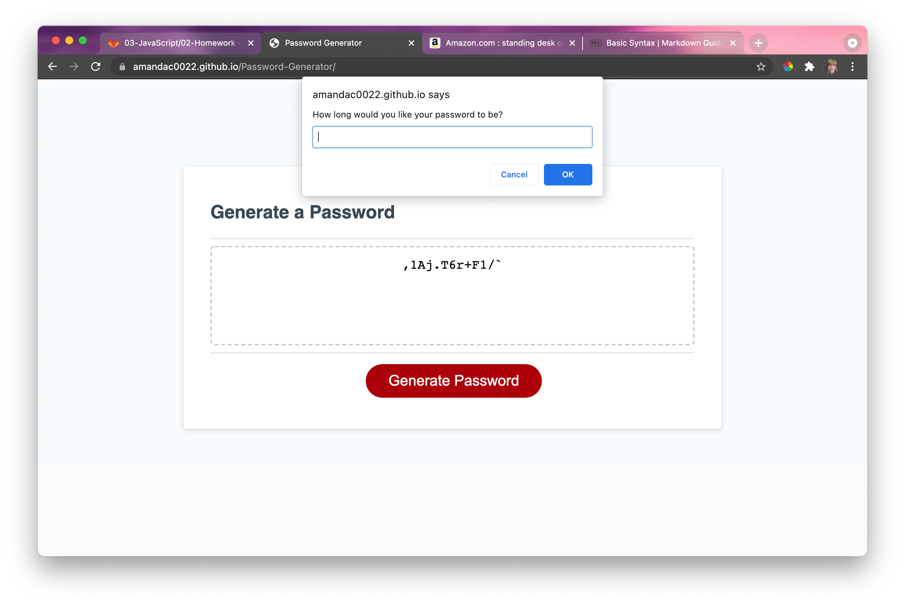

# Password-Generator
## Description 
This project was to build a random password generator. It will ask the user for input for: 
- length of the password
- includes lowercase letters
- includes uppercase letters 
- include numbers 
- includes symbols 

Once user has answered all of the prompts, the generater will display a random password on the webpage. 

## Link to Deployed Webpage
https://amandac0022.github.io/Password-Generator/

## Link to Github Repo 
https://github.com/AmandaC0022/Password-Generator

## Screenshots of Deployed Webpage

